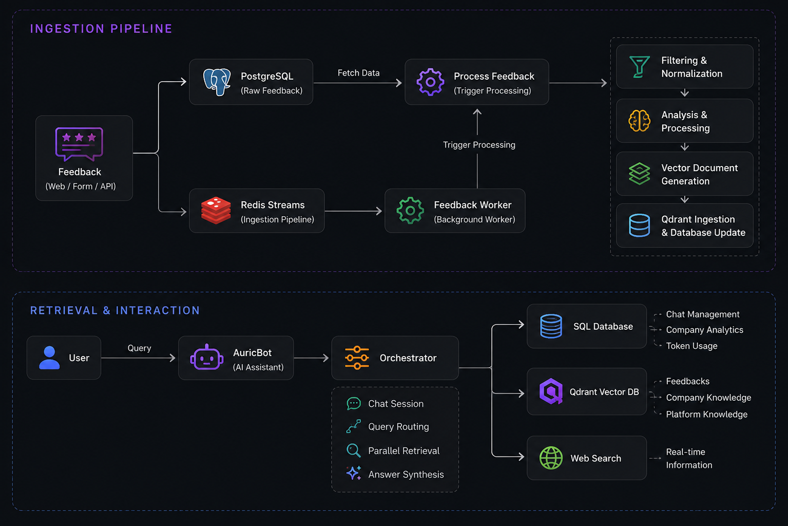

<h1 align="center">Auric</h1>

<p align="center">
AI-powered Customer Intelligence Platform
</p>

<p align="center">
  <a href="https://auric.kartikpokhriyal.work/">
    
  </a>
</p>

AI-powered customer feedback intelligence platform that helps businesses collect, analyze, and interact with customer feedback using Large Language Models (LLMs) and Retrieval-Augmented Generation (RAG).

Auric transforms raw customer feedback into actionable insights through an asynchronous processing pipeline, while enabling organizations to query their feedback, internal knowledge, and business analytics using natural language.

---


## Features

- Multi-tenant SaaS architecture with company-level data isolation
- Shareable feedback forms for customer feedback collection
- AI-powered sentiment analysis and structured insight generation
- Asynchronous feedback processing using Redis Streams
- Hybrid RAG pipeline with dense + sparse retrieval
- AuricBot for natural language interaction with company data
- Company knowledge ingestion (Policies, FAQs, Documentation, etc.)
- SQL analytics retrieval alongside vector search
- Live web search integration for up-to-date information
- Interactive analytics dashboard
- JSON & CSV feedback export
- Rate limiting and abuse protection

---

## Architecture



---

## Auric API integration

The web app uses its authenticated API routes as a backend-for-frontend for Auric. Configure these server-only variables (do not prefix them with `NEXT_PUBLIC_`):

```env
AURIC_API_URL=https://your-auric-api.example
AURIC_API_JWT_SECRET=your-shared-hs256-secret
AURIC_API_JWT_ISSUER=auric-auth
AURIC_API_JWT_AUDIENCE=auric-api
```

The API deployment must use the same secret, issuer, and audience. The app mints five-minute bearer tokens only on the server from the authenticated session; browsers never receive the signing secret or send a tenant ID to Auric.

---

## Tech Stack

| Category | Technologies |
|----------|--------------|
| **Frontend** | Next.js • React • TypeScript • Tailwind CSS |
| **Backend** | Python • PostgreSQL • Prisma ORM • Redis Streams |
| **AI & LLM** | LangChain • Groq • Qdrant • Hybrid Search (Dense + BM25) • Retrieval-Augmented Generation (RAG) |

---

## Engineering Highlights

- Designed a multi-tenant architecture with secure company-level data isolation.
- Built an asynchronous ingestion pipeline using Redis Streams for scalable background processing.
- Implemented hybrid RAG by combining company documents, processed feedback, SQL analytics, and live web search.
- Reduced query latency through parallel retrievaland concurrent database operations.
- Implemented Server-Sent Events (SSE) for real-time AI response streaming.
- Improved reliability using retry mechanisms, optimistic locking, and automatic recovery workflows.
- Optimized database performance through indexing, aggregation queries, caching, and cursor-based pagination.
- Protected APIs with Redis-based rate limiting and automated abuse prevention.


## Future Work

- Testimonial Wall Builder
- Larger Context Memory
- CRM integrations
- Advanced analytics and trend detection

### Installation

```bash
# Clone the repository
git clone https://github.com/kartikk-91/auric-web

# Navigate to the project
cd auric

# Install dependencies
npm install
```
### Database

```bash
# Generate Prisma Client
pnpm prisma generate

# Apply database migrations
pnpm prisma migrate deploy
```
### Start Development Server

```bash
npm run dev
```

The application will be available at:

```text
http://localhost:3000
```
